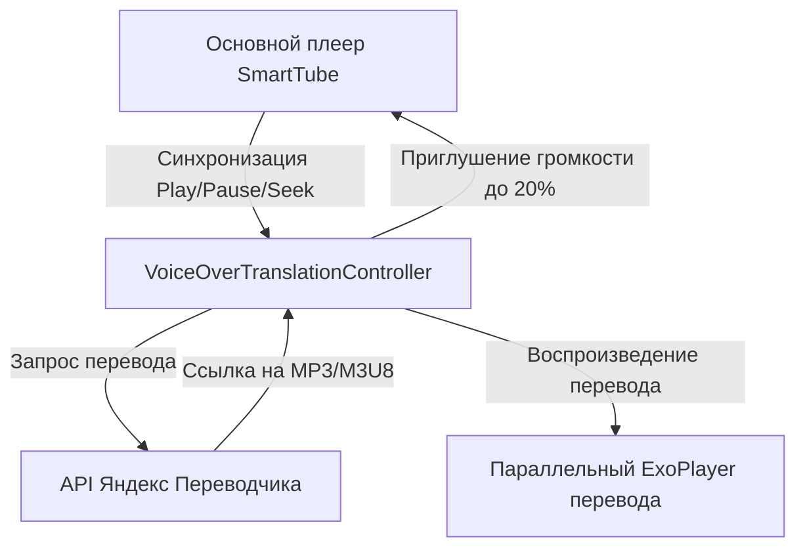

# Глобальная память проекта: SmartTube - Voice-Over Translation Plugin

## 1. Паспорт проекта
* **Суть проекта:** Интеграция изолированного плагина голосового перевода (закадровой озвучки) видео на русский язык через API Яндекс.Переводчика (аналог расширения VOT) в Android-приложение SmartTube (для Android TV).
* **Технологический стек:** Java, Android SDK, Android Leanback UI, ExoPlayer, RxJava 2, OkHttp, Protocol Buffers (Protobuf).
* **Команды запуска:**
  * Сборка отладочной версии: `.\gradlew.bat assembleDebug`
  * Установка на эмулятор: `adb install -r smarttubetv\build\outputs\apk\debug\smarttubetv-debug.apk`

## 2. Архитектура системы
* **Интеграция в плеер:** Минимально инвазивное вмешательство. В `PlaybackPresenter.java` добавляется один вызов нашего контроллера. Во вторичные действия плеера в `VideoPlayerGlue.java` добавляется кнопка перевода.
* **Основные компоненты плагина:**
  1. `TranslateAction` - кнопка управления в плеере. Наследует `MultiAction` и имеет 3 состояния (Серый - выключено, Желтый - перевод загружается, Зеленый - перевод готов и воспроизводится).
  2. `VoiceOverTranslationController` - контроллер (расширяет `BasePlayerController`), управляющий жизненным циклом перевода, запросами к API Яндекса и параллельным воспроизведением звукового потока.
  3. `VoiceOverTranslationData` - класс-хранилище настроек (расширяет `DataSaverBase`), сохраняет настройки в SharedPreferences.
  4. `VoiceOverTranslationSettingsPresenter` - UI диалога настроек, открывающийся при длинном нажатии на кнопку.
  5. `ic_translate.xml` - векторная иконка "A" + "Иероглиф 文" в ресурсах drawable.
* **Схема воспроизведения:**

## 3. Статус разработки (Status Board)
| Компонент / Фича | Статус | Метод верификации | Ссылка на код |
| :--- | :--- | :--- | :--- |
| Базовая сборка проекта | Verified | Успешная сборка через VPN и запуск в эмуляторе | [build.gradle](file:///c:/Antigravity%20projects/SmartTube/build.gradle) |
| Алгоритм запросов к Яндекс API | Verified | Проверен в консольном Java-тесте, получен аудио-поток | [YandexTranslationTest.java](file:///C:/Users/wisey/.gemini/antigravity/brain/83809fd7-2687-4329-b4f8-5ac028744f49/scratch/YandexTranslationTest.java) |
| Иконка "А"+"Иероглиф" | In Progress | Создание векторного файла drawable | [ic_translate.xml](file:///c:/Antigravity%20projects/SmartTube/smarttubetv/src/main/res/drawable/ic_translate.xml) |
| Логика кнопок и настроек | In Progress | Разработка `TranslateAction` и меню настроек | [VoiceOverTranslationController.java](file:///c:/Antigravity%20projects/SmartTube/common/src/main/java/com/liskovsoft/smartyoutubetv2/common/app/models/playback/controllers/VoiceOverTranslationController.java) |

## 4. Журнал принятых и отвергнутых решений (ADR / Decision Log)

### [ADR-0001] Архитектура воспроизведения аудио
* **Дата:** 2026-06-18
* **Контекст:** Требовалось встроить воспроизведение сторонней аудиодорожки (перевода) параллельно с основным видеопотоком.
* **Принятое решение:** Использовать второй независимый экземпляр `SimpleExoPlayer` для озвучки, управляемый контроллером. Громкость основного видео приглушается до 20%, перевод воспроизводится на 100%. События паузы, воспроизведения и перемотки синхронизируются.
* **Отвергнутые альтернативы:** `MergingMediaSource` в основном ExoPlayer. Отказались, потому что это требует полной перезагрузки плеера, прерывает воспроизведение видео и делает невозможным динамическое переключение голосов/языков и включение/выключение перевода "на лету" без буферизации видео.
* **Последствия:** Необходимость вручную синхронизировать состояние двух плееров (пауза/старт/перемотка). Небольшая нагрузка на декодер аудио, не критичная для современных Android TV устройств.

### [ADR-0002] Отображение иконки с 3 цветами в Leanback UI
* **Дата:** 2026-06-18
* **Контекст:** Стандартный `TwoStateAction` поддерживает только 2 состояния и жестко приводит Drawable к `BitmapDrawable`. Новая кнопка должна поддерживать 3 состояния (выключено - серый, идет перевод - желтый, готово - зеленый).
* **Принятое решение:** Создать класс `TranslateAction`, наследующий `MultiAction`. При инициализации VectorDrawable `ic_translate.xml` программно рендерится в `Bitmap`, после чего создаются 3 `BitmapDrawable` с наложенными цветовыми фильтрами (серый, желтый, зеленый).
* **Отвергнутые альтернативы:** Использование PNG-картинок для каждого состояния. Отказались, так как векторная графика выглядит четче и занимает меньше места.
* **Последствия:** Простая поддержка любых цветов и плавное переключение между тремя состояниями.

### [ADR-0003] Логика авто-паузы видео на время ожидания перевода
* **Дата:** 2026-06-18
* **Контекст:** Пользователь хочет иметь возможность автоматически ставить видео на паузу при нажатии кнопки "Перевод" до тех пор, пока перевод/озвучка не загрузится (статус FINISHED).
* **Принятое решение:** Добавить в настройки плагина переключатель "Ставить видео на паузу при загрузке". Если он включен, при переходе кнопки в состояние "Ожидание" (желтый) основное видео ставится на паузу. При переходе в состояние "Готово" (зеленый) воспроизведение основного видео возобновляется автоматически вместе с запуском аудиодорожки перевода.

## 5. Дорожная карта и Бэклог идей (Roadmap)
* `[ ]` **Шаг 1:** Создать иконку `ic_translate.xml` и объявить ID `action_voice_over_translation`.
* `[ ]` **Шаг 2:** Создать класс хранения настроек `VoiceOverTranslationData.java`.
* `[ ]` **Шаг 3:** Реализовать `VoiceOverTranslationSettingsPresenter.java` для меню настроек по долгому нажатию.
* `[ ]` **Шаг 4:** Реализовать `TranslateAction.java` с тремя состояниями и `VoiceOverTranslationController.java`.
* `[ ]` **Шаг 5:** Интегрировать кнопку в `VideoPlayerGlue.java` и контроллер в `PlaybackPresenter.java`.
* `[ ]` **Шаг 6:** Протестировать работу в эмуляторе, проверить авто-паузу и смену цветов иконки.
